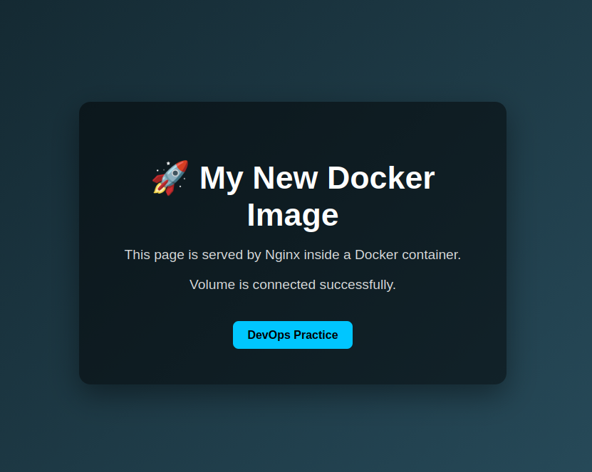

# 📄 Day 28 — Dockerfile (Building Custom Images)

## 🧠 Overview

A **Dockerfile** is a set of instructions used to build a Docker image.

👉 It describes:

* application environment
* dependencies
* files
* startup command

---

## 📦 Basic Example

```dockerfile id="4xk1n7"
FROM nginx
COPY index.html /usr/share/nginx/html/index.html
```

---

## 🔍 Explanation

### 🔹 FROM nginx

* base image
* we reuse an existing image

👉 starting point of the build

---

### 🔹 COPY

```dockerfile id="j6m9q2"
COPY index.html /usr/share/nginx/html/index.html
```

* copies file from host → into image
* replaces default nginx page

---

## ⚙️ Build Image

```bash id="7o2k9f"
docker build -t my-nginx .
```

### 🔎 Flags:

* `build` → build image
* `-t my-nginx` → tag (name of image)
* `.` → current directory (build context)

---

## 🚀 Run Container

```bash id="p8s4m1"
docker run -d -p 8080:80 my-nginx
```

### 🔎 Flags:

* `-d` → run in background (detached)
* `-p 8080:80` → port mapping

```text
host:container
8080 → 80
```

---

## 🔥 Test

```bash id="2w9n5c"
curl localhost:8080
```

👉 you should see your custom page

---

## 📚 Common Dockerfile Instructions

### 🔹 RUN

```dockerfile id="k3c7z1"
RUN apt update && apt install -y curl
```

* runs command during build
* used to install packages

---

### 🔹 WORKDIR

```dockerfile id="m5q2x8"
WORKDIR /app
```

* sets working directory

---

### 🔹 COPY

```dockerfile id="n9r4t6"
COPY . /app
```

* copies files into image

---

### 🔹 CMD

```dockerfile id="c8y1v3"
CMD ["nginx", "-g", "daemon off;"]
```

* defines what runs when container starts

---

## ⚠️ RUN vs CMD

| instruction | when it runs |
| ----------- | ------------ |
| RUN         | build time   |
| CMD         | runtime      |

---

## 🧠 DevOps Thinking

```text
Dockerfile = infrastructure as code
```

👉 You describe environment once → run anywhere

---

## 📊 Example (More Advanced)

```dockerfile id="b7x3m2"
FROM ubuntu

RUN apt update && apt install -y curl

CMD ["bash"]
```

---

## 🛠️ Build Process

```text id="9h2l6q"
Dockerfile
↓
docker build
↓
image
↓
docker run
↓
container
```

---

## 💡 Key Takeaways

* Dockerfile defines how image is built
* images are immutable (unchangeable)
* containers are created from images
* always rebuild image instead of modifying container

---

## 📝 Notes

* keep images simple
* use minimal base images
* avoid unnecessary packages
* each instruction creates a layer


🧪 Labs
🔹 Lab 1 — Custom Nginx Image

Built a custom Docker image based on nginx.

Steps:

created custom index.html # Added new *.html file in folder
used Dockerfile with COPY
built image
ran container

Result:

custom web page served via Docker
accessible on localhost:8080


🔹 Lab 2 — Ubuntu Image with curl

Built custom image based on ubuntu.

Steps:

used RUN apt update
installed curl
created custom image

Result:

container includes curl
verified with:
curl google.com


